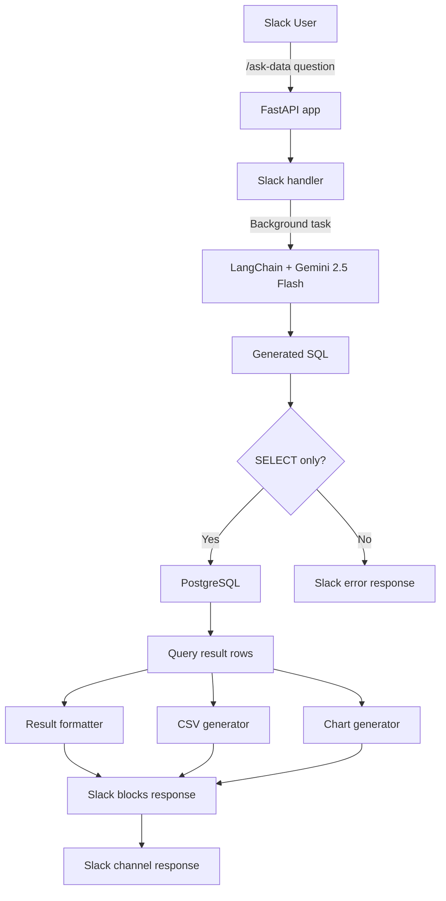
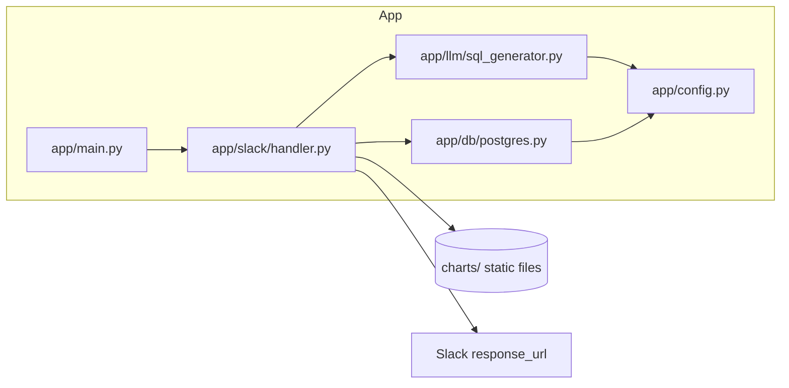
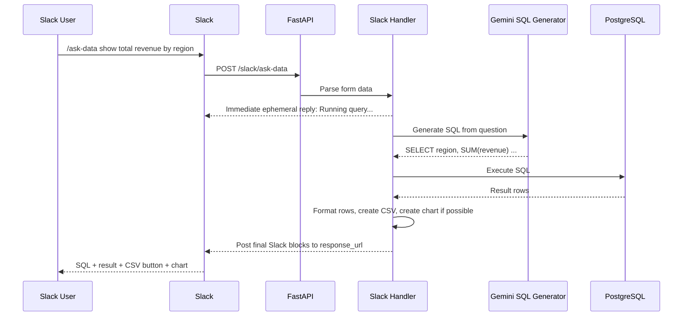
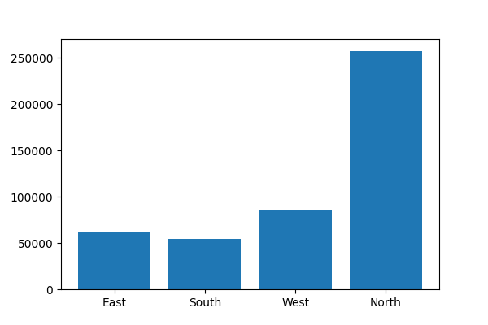

# Slack AI Data Bot

Slack AI Data Bot is a FastAPI-based Slack application that converts natural language business questions into PostgreSQL `SELECT` queries using LangChain + Gemini, executes them on PostgreSQL, and returns formatted results inside Slack.

The project also supports:

- CSV export through a Slack response button
- Chart generation for 2-column label + numeric result sets
- Static hosting of generated CSV and chart files through FastAPI

## Table of Contents

- [Project Overview](#project-overview)
- [Features](#features)
- [Architecture](#architecture)
- [Detailed Flow](#detailed-flow)
- [Project Structure](#project-structure)
- [Prerequisites](#prerequisites)
- [Environment Variables](#environment-variables)
- [Local Setup](#local-setup)
- [Slack App Setup](#slack-app-setup)
- [API Endpoints](#api-endpoints)
- [Database Schema](#database-schema)
- [Example Queries](#example-queries)
- [Screenshots](#screenshots)
- [Troubleshooting](#troubleshooting)
- [License](#license)

## Project Overview

The bot exposes a Slack slash command endpoint:

- `/slack/ask-data`: accepts a natural language question, generates SQL, executes the query, and posts the SQL, result preview, CSV export button, and chart back into Slack

Current implementation scope in this repository:

- FastAPI backend
- Slack slash command handling
- Gemini-powered NL to SQL generation
- PostgreSQL query execution
- CSV export and chart image generation

Not currently implemented in this codebase:

- Scheduled reports
- n8n workflow integration
- LRU cache for repeated prompts

## Features

| Feature               | Description                                                                                    |
| --------------------- | ---------------------------------------------------------------------------------------------- |
| NL to SQL             | Converts plain English questions into a single PostgreSQL `SELECT` query                     |
| Query execution       | Runs generated SQL against the PostgreSQL database                                             |
| Slack response blocks | Sends SQL and formatted result preview back to Slack                                           |
| CSV export            | Generates a CSV file and exposes it through a Slack button                                     |
| Chart generation      | Creates a bar chart PNG when the result has exactly 2 columns and the second column is numeric |
| Background processing | Returns an immediate Slack acknowledgment and completes the query in a FastAPI background task |
| Static file hosting   | Serves generated CSV and PNG files from the `/charts` route                                  |
| Safety check          | Rejects generated SQL that does not start with `SELECT`                                      |

## Architecture



### Component View



## Detailed Flow



## Project Structure

```text
slackai-databot/
├── app/
│   ├── main.py
│   ├── config.py
│   ├── db/
│   │   └── postgres.py
│   ├── llm/
│   │   └── sql_generator.py
│   ├── prompts/
│   │   └── sql_prompt.txt
│   └── slack/
│       └── handler.py
├── assets/
│   └── screenshots/
├── charts/
├── scripts/
│   └── seed_db.sql
├── docker-compose.yml
├── requirements.txt
└── README.md
```

## Prerequisites

| Tool           | Version                                             |
| -------------- | --------------------------------------------------- |
| Python         | 3.10+                                               |
| Docker Desktop | Latest                                              |
| PostgreSQL     | Provided through Docker Compose                     |
| Git            | Latest                                              |
| Slack App      | Required for slash command setup                    |
| ngrok          | Required for exposing local FastAPI server to Slack |

## Environment Variables

Create a `.env` file in the project root.

| Variable                 | Required | Description                      |
| ------------------------ | -------- | -------------------------------- |
| `POSTGRES_HOST`        | Yes      | PostgreSQL host                  |
| `POSTGRES_DB`          | Yes      | Database name                    |
| `POSTGRES_USER`        | Yes      | Database username                |
| `POSTGRES_PASSWORD`    | Yes      | Database password                |
| `POSTGRES_PORT`        | Yes      | PostgreSQL port                  |
| `GEMINI_API_KEY`       | Yes      | Gemini API key used by LangChain |
| `SLACK_SIGNING_SECRET` | Yes      | Slack signing secret             |

Example:

```env
POSTGRES_HOST=localhost
POSTGRES_DB=analytics
POSTGRES_USER=postgres
POSTGRES_PASSWORD=postgres
POSTGRES_PORT=5433
GEMINI_API_KEY=your_gemini_api_key_here
SLACK_SIGNING_SECRET=your_slack_signing_secret_here
```

Note:

- The current code reads `SLACK_SIGNING_SECRET` but does not yet validate Slack request signatures.
- The public base URL used for CSV/chart links is currently hardcoded as `NGROK_URL` in `app/slack/handler.py`.

## Local Setup

1. Clone the repository.

```bash
git clone <your-repo-url>
cd slackai-databot
```

2. Create and activate a virtual environment.

```bash
python -m venv .venv

# Windows PowerShell
.\.venv\Scripts\Activate.ps1
```

3. Install dependencies.

```bash
pip install -r requirements.txt
```

4. Start PostgreSQL with Docker.

```bash
docker-compose up -d
```

5. Seed the database.

Using local `psql`:

```bash
psql -h localhost -p 5433 -U postgres -d analytics -f scripts/seed_db.sql
```

Using Docker:

```bash
docker exec -i slack-ai-postgres psql -U postgres -d analytics < scripts/seed_db.sql
```

6. Start the FastAPI server.

```bash
uvicorn app.main:app --host 0.0.0.0 --port 8000 --reload
```

7. Expose the local server to Slack.

```bash
ngrok http 8000
```

8. Update `NGROK_URL` in `app/slack/handler.py` with your active ngrok URL so generated CSV and chart links resolve correctly.

## Slack App Setup

Use [https://api.slack.com/apps](https://api.slack.com/apps).

| Section          | Setting                                                 |
| ---------------- | ------------------------------------------------------- |
| Slash Commands   | `/ask-data` -> `https://<ngrok-url>/slack/ask-data` |
| OAuth Bot Scopes | `commands`, `chat:write`                            |
| Install App      | Install or reinstall to workspace                       |

Setup steps:

1. Create or open your Slack app.
2. Add a slash command named `/ask-data`.
3. Set the request URL to `https://<your-ngrok-domain>/slack/ask-data`.
4. Add bot scopes `commands` and `chat:write`.
5. Install or reinstall the app to your workspace.
6. Copy the signing secret into `.env` as `SLACK_SIGNING_SECRET`.

## API Endpoints

| Method   | Endpoint                     | Purpose                                                                                                    |
| -------- | ---------------------------- | ---------------------------------------------------------------------------------------------------------- |
| `POST` | `/slack/ask-data`          | Receives the Slack slash command, schedules background processing, and returns an immediate acknowledgment |
| `GET`  | `/charts/<generated-file>` | Serves generated CSV and chart files through FastAPI static hosting                                        |

### `/slack/ask-data` request flow

- Reads Slack form fields `text` and `response_url`
- Starts `process_query` in a FastAPI background task
- Immediately returns:

```json
{
  "response_type": "ephemeral",
  "text": "Running query..."
}
```

## Database Schema

The bot is currently designed around the `sales_daily` table seeded by `scripts/seed_db.sql`.

```sql
CREATE TABLE IF NOT EXISTS sales_daily (
    date date NOT NULL,
    region text NOT NULL,
    category text NOT NULL,
    revenue numeric(12,2) NOT NULL,
    orders integer NOT NULL,
    created_at timestamptz NOT NULL DEFAULT now(),
    PRIMARY KEY (date, region, category)
);
```

Sample seeded rows cover regions such as `North`, `South`, `East`, and `West`, and categories such as `Electronics`, `Grocery`, and `Fashion`.

## Example Queries

```text
/ask-data show total revenue by region
/ask-data which region has the lowest revenue?
/ask-data what is the average revenue per category?
/ask-data show all sales data
```

Typical result behavior:

- The generated SQL is shown in a Slack code block
- Query results are rendered as a formatted text table
- A button is included to export the result as CSV
- A chart image is attached when the result has exactly two columns and the second column is numeric

## Screenshots




## Troubleshooting

| Issue                                 | Likely Cause                                                      | Fix                                                                                        |
| ------------------------------------- | ----------------------------------------------------------------- | ------------------------------------------------------------------------------------------ |
| Slack shows a timeout warning         | The server did not return quickly enough                          | Keep the immediate acknowledgment path intact and ensure background task execution is used |
| CSV or chart link does not open       | `NGROK_URL` is stale or incorrect                               | Update `NGROK_URL` in `app/slack/handler.py` and restart the server                    |
| Gemini SQL generation fails           | Invalid or missing `GEMINI_API_KEY`                             | Verify `.env`, restart the app, and confirm the key is active                            |
| Database connection fails             | PostgreSQL container is not running or env values are wrong       | Check `docker-compose`, confirm port `5433`, and verify `.env` values                |
| Query returns no results              | Seed data not loaded or query conditions do not match sample data | Re-run `scripts/seed_db.sql` and test with simpler aggregate queries                     |
| Only SELECT queries are allowed error | Generated SQL did not begin with `SELECT`                       | Tighten the prompt or simplify the question asked in Slack                                 |

## License

This project is licensed under the terms in `LICENSE` if a license file is added to the repository.
